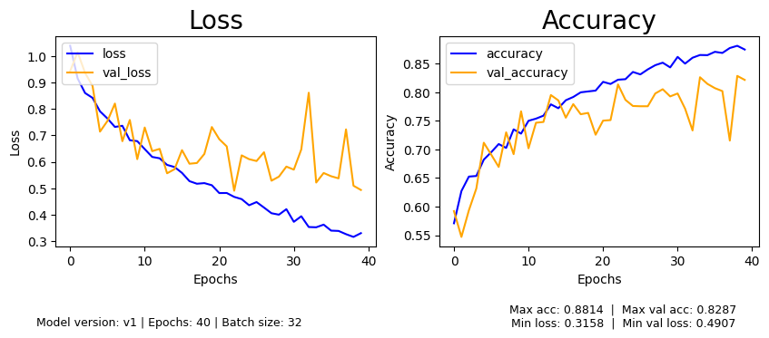
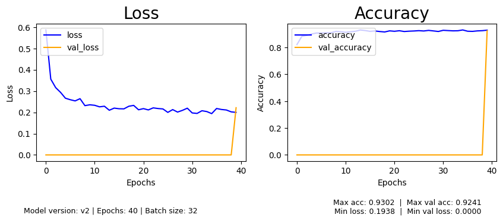

# Waste-Classification
**This project is actively in development**

# Overview
Implements a custom CNN architecture trained on 11,000 images that categorizes waste into 4 waste categories.
Implements a CNN using transfer learning with MobileNetV2.

# Results

### Custom CNN (v1)
| Class       | Precision | Recall | F1-Score | Support |
|-------------|-----------|--------|----------|---------|
| not_allowed | 0.90      | 0.76   | 0.82     | 625     |
| paper       | 0.77      | 0.80   | 0.78     | 1500    |
| plastic     | 0.79      | 0.59   | 0.68     | 1241    |
| trash       | 0.80      | 0.88   | 0.84     | 3024    |
| **Overall** | **0.81**  |        |          | **6390**|



---

### Transfer Learning MobileNetV2 (v2)
| Metric       | Value  |
|--------------|--------|
| Max Accuracy | 0.9264 |
| Max Val Acc  | 0.9330 |
| Min Loss     | 0.1988 |
| Min Val Loss | 0.1997 |



---

# Instructions
- Create a virtual environment:
  ```bash
  python -m venv venv
  source venv/bin/activate  # Linux/macOS
  venv\Scripts\activate     # Windows
  ```
- Install dependencies:
  ```bash
  pip install -r requirements.txt
  ```
- Uncomment the respective lines in `run.py`. When training a new model, adjust the number of epochs in `config.py`.
- Run the program:
  ```bash
  python run.py
  ```

# Structure
```
Waste-Classification/
├── run.py                  # Main entry point
└── app/
    ├── config.py           # Constants (epochs, batch size, class names, paths)
    ├── main.py             # Main model logic
    ├── data/               # Training and testing images
    ├── models/             # CNN models (v1 custom, v2 MobileNetV2)
    ├── output/
    │   ├── logs/           # Training logs
    │   ├── models/         # Saved .pth model files
    │   └── plots/          # Loss and accuracy plots
    ├── camera/             # Webcam inference runner
    └── utils/              # Helper functions (model loading, plotting, etc.)
```

# Stack
- Python, PyTorch, OpenCV, Matplotlib, torchvision, torchmetrics

## Datasets
- https://www.kaggle.com/datasets/sumn2u/garbage-classification-v2?select=standardized_256
- https://www.kaggle.com/datasets/jvnr1495/batteries