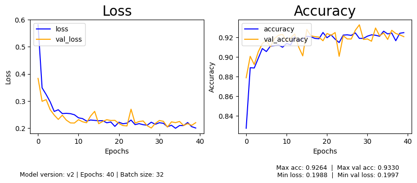

# Waste-Classification
# Purpose
This project explores how computer vision and deep learning can be applied into a real-world problem, improper waste sorting. Pollution is a major issue in the world today, and somethign that contributes to this is improper waste sorting. This project aims to solve this issue by using a CNN image classifier paired with YOLO-v8.

# Overview
This model combines: 
* Either a custom CNN model or the MobileNetV2 model. 
* YOLO object detection to locate items in the camera feed.
* A live camera pipeline to detect objects in real time.

# Results

### Custom CNN (v1)
| Metric       | Value  |
|--------------|--------|
| Max Accuracy | 0.88   |
| Max Val Acc  | 0.83   |
| Min Loss     | 0.32   |
| Min Val Loss | 0.49   |


---

### Transfer Learning MobileNetV2 (v2)
| Metric       | Value  |
|--------------|--------|
| Max Accuracy | 0.93   |
| Max Val Acc  | 0.93   |
| Min Loss     | 0.20   |
| Min Val Loss | 0.20   |



---

# Instructions
- Create a virtual environment:
  ```bash
  python -m venv venv
  source venv/bin/activate  # Linux/macOS
  venv\Scripts\activate     # Windows
  ```
- Install dependencies:
  ```bash
  pip install -r requirements.txt
  ```

- (If wanting to train a new model) Download the dataset:
```bash
  .\scripts\download_data.ps1   # Windows
  bash scripts/download_data.sh # Mac/Linux
```

- Uncomment the respective lines in `run.py`. When training a new model, adjust the number of epochs in `config.py`.
- Run the program:
  ```bash
  python run.py
  ```

# Structure
```
Waste-Classification/
├── run.py                  # Main entry point
├── scripts/                # Contains the scripts needed to download the dataset 
└── app/
    ├── config.py           # Constants (epochs, batch size, class names, paths)
    ├── main.py             # Main model logic
    ├── data/               # Training and testing images
    ├── models/             # CNN models (v1 custom, v2 MobileNetV2), and YOLO model
    ├── output/
    │   ├── logs/           # Training logs
    │   ├── models/         # Saved .pth model files
    │   └── plots/          # Loss and accuracy plots
    └── utils/              # Helper functions (model loading, plotting, etc.)
```

# Stack
- Python, PyTorch, OpenCV, Matplotlib, YOLO-v8

## Dataset
- https://www.kaggle.com/datasets/alistairking/recyclable-and-household-waste-classification/data